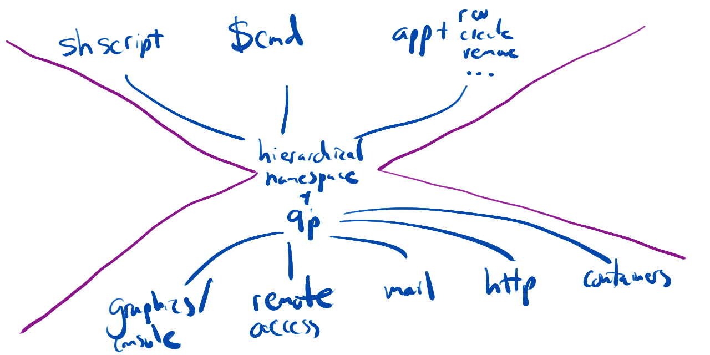
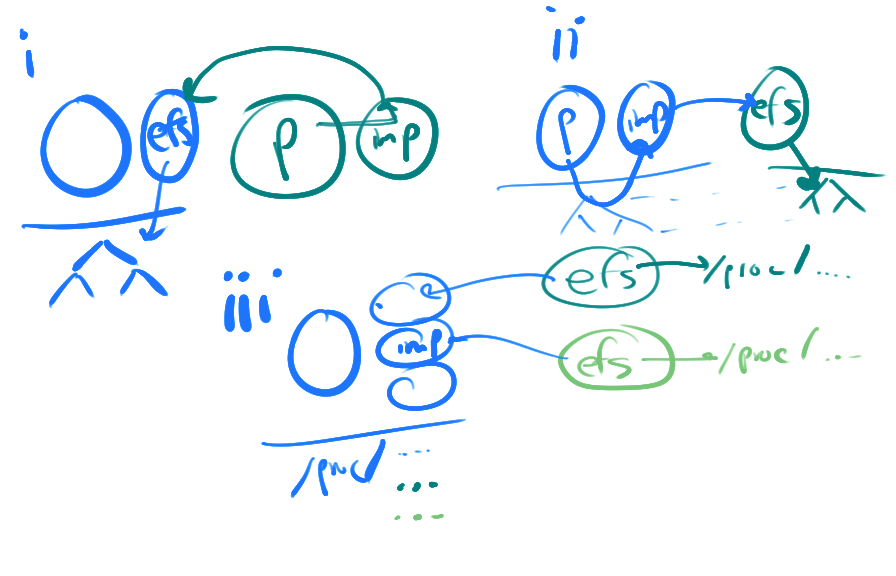

# L1

1. Office hours R2-3, F9-10
2. Grades on L1
3. Some replies are too long
4. Examples of significant insight:

	- Your view in the video was to start with a specific goal, and not to abstract or over-generalize excessively. Is there a good way to find the balance between scoping and reducing redundancy? For example, if I scope too small, it could take me twice as long to re-implement a service to incorporate multiple children. However, if I'd started out assuming this service would need to be extended in the future, I could save time, but possibly build up extended accidental complexity/debt.
	- It is odd to think that abstractions actually limit power; however, this limiting often reduces the time and skill it takes a developer to use a resource and provides protection from unwanted events. In some sense, the abstraction gives more power to those who understand the higher-level system, but not the lower-level system. Additionally, you are given the power to use a resource without having to worry about possible negative effects.
	- We generally associate power with more control and at first that is counterintuitive because abstractions adds constraints to lower level interfaces and takes away power from the user but looking closely abstractions does make it much easier to deal with the system and not think about the lower level implementations and that makes abstractions powerful. For example a file system module already takes care of the most efficient way of handling bytes of data that the user does not have to think about and can simply read and write the data.

5. Questions:

	- Discuss technical debt, avoiding it, and its properties.
	- Abstraction takes away power to use resources in specific manners.
		How would you design a multi-user system to maximally provide power to software?
		What are the trade-offs here?

6. Discussion:

	- Graph on development velocity and technical debt
	- Can't we design-away technical debt (can't know all problems, new problems arrive dynamically)
		Take away: we are bad at predicting what's necessary in a year.
	- Doesn't the generality pay off in the end?
		What you pay now will reduce complexity later?
	- Understanding of constraining complexity, thus power.
		Abstractions remove potential.
		Possible to implement system that can be used for most anything?
		What would this require?
	- Layered/Hierarchical/DAG: which is good when?
	- Languages and modularity, accidental complexity, and semantic gap -- C for applications, Java for kernel.

# C1

- System vs. application: define vs. use APIs.
	Libraries complicate this: define resources *and* multiplex them vs. define them
	System: 1. no shared pointers, and 2. persistence thus naming
- Is Zircon an event-driven system?
	Does it require its applications to be written in an event-driven manner?

## Understanding the API

- Event sources go beyond the event API `zx_event|eventpair_create`, and include [processes](https://fuchsia.dev/fuchsia-src/reference/syscalls/process_create) (e.g. "Process handles may be waited on and will assert the signal ZX_PROCESS_TERMINATED when the process exits."), threads, etc...

	- How about `futex`es?
	- How about `channel`s?
	- event sources? (channels, process termination, interrupts)
	- not just `zx_event*`

- What is the difference between `zx_object_signal` and `zx_object_signal_peer`?
- `zx_object_wait_many` vs. [`zx_port_wait()`](https://fuchsia.dev/fuchsia-src/reference/kernel_objects/port)?
	How is `zx_port_wait` setup and why?
	Why does it use `zx_object_wait_async` to setup instead of the normal synchronous version?
- There is a timeout as an argument to `zx_object_wait_many`; does this feel "wrong" in any way?
- Is there a way to block until all of a set of *multiple* events have arrived?
	Why or why not?

## The UNIX comparison

- UNIX: timers, signals, process termination, *and* fds.
	Linux extends with `timerfd_create`, `signalfd`, process fds (`pidfd_open`).
	Comment on these APIs.

# L2

## Assess the following APIs

- `fork` composes with threads (i.e. is it thread-safe), buffered I/O (see `fflush`)?

	- vs. `posix_spawn`/`CreateProcess`
	- benefits of `fork`?

- What if we only had `mmap`, not `read`/`write`?

	- What benefits would there be?
	- What about network sockets?
		Pipes?
	- A downside is that files that *grow* could be tedious to access.
		How could we use the current `mmap` when files can grow?
		If we changed `mmap` to transparently increase the mapped region as files grow, would this be a "good" API?

## Discussion

Organization:

- How insightful do all questions have to be?
- Questions as a guide first, evaluation second.
- demikernel vs. libuv

Questions:

- `fork`

	- threads
	- double output with buffered
	- benefit: trivial inheritance of resources! (if you want them to inherit most resources)

- `mmap`

	- shared memory for all!
			Requires locks.
			But you kinda need to worry about concurrent `write`s as well (but FS can implement critical sections for modifications for each single write)
	- use of `truncate`
	- `mmap` does not support polymorphism in the same way: `read`/`write` vs. `load`/`store`
	- What if everything was mapped as a DMA-like ring buffer?
			See Demikernel for Tuesday!

Clarifications:

- What are the benefits of orthogonality?
	When might we want to trade it away?
	What metrics do we use to make that decision?
- composition = `tranfer() {inc(); dec()}`, not defining a new `transfer`
- commutativity for open and the importance of specifications, and a mapping to scalable implementations

## Questions

- When balancing complexity and interface simplicity, does performance always win out?
	Do we have to live with the resulting complexity?
- Which of these aspects of interface design do we prioritize if we're on a deadline, and can't do it all?
- Is idempotency equivalent to deterministic functions in math?
	No.
	Deterministic functions (if I understand the referenced concept) return output based solely on the input.
	These are *pure* functions or (as I said in the lecture) "stateless".
	Idempotent functions can have output based on "hidden" state (think, a cache, a disk, etc...).
	If some of those operations can *change* the state, then another otherwise idempotent functions retrieve that state, the retrieval functions are not idempotent with respect to the update operations.
	However, the retrieval and update operations are likely idempotent with respect to themselves.
	A simplistic (and common) view on idempotency ignores the relationship of these functions to each other.
- Which functions actually *are* re-entrant?
	`strtok_r` stores the state in the arguments passed in, thus will execute re-entrantly for different sets of arguments; similar arguments apply to many of the `str*` class of `string.h` functions; and, generally, any API that depend only on arguments to compute the results.
	Careful implementation in stateful functions can also be re-entrant, but this requires a lot of consideration and work; most modern libraries don't consider this, and instead require that signal handlers are simple and restricted in scope.
- Are there mechanisms to avoid breaking orthogonality?
	Not that I know of.
	That's why we're discussing it in the class: if you're aware of the goals, you can consider them in interface creation.
	If you break then, then you can do so intentionally, and document why.
- How can `open` not commute -- two calls, regardless the order seem identical for all functionality that matters, right?
	For a user's perspective, it *feels* like they are identical.
	From a shell's perspective, they are *not*.
	For example, `sh` in `xv6` *requires* that the order of opens translates into *specific* file descriptors being allocated (see the [careful dance](https://github.com/gwu-cs-os/gwu-xv6/blob/master/sh.c#L100-L112) with `close` and `dup` when creating pipes).
	More importantly, the *specification* of how *open* and *dup* behave is what we assess when judging commutativity.
	Human perceived importance of various behaviors in APIs are not very relevant, only the specification.
	POSIX's *specification* requiring allocation of the lowest-free file descriptor ensures that two `open` (or `dup`) calls do *not* commute.
	This means that an implementation that adheres to this specification cannot be scalable.
	This hopefully emphasizes why the *specification*, not a *sense* about what part of APIs are important, is the relevant detail to focus on.
- Is it possible to have a thread-safe function be re-entrant?
	Yes.
	A few examples (I'm sure there are more, but these are the ones that popped into my head):

	1. You can use recursive/re-entrant locks (see the book), and track if your own thread is already processing in a critical section, and figure out some way to proceed without touching the shared structures (e.g. return some failure mode).
	2. You can use wait-free algorithms that only use atomic instructions, and avoid `cas` loops, thus can proceed in the signal handler regardless where the preemption happened in the main thread's execution.
- The less our design leverages global state, the better?
	Generally, yes.
	It is much easier to test, and implement functions that are isolated from the effects of other functions -- in some sense, avoiding global state massively increases compositionality.
	However, it is impossible to provide many system services with this property.
	We always have some global structures as they track the state of system resources.
- Is there a general way to create composable APIs for shared resources?
	Not that I know of.
	A common technique, if we can call it that, is to make the API more complicated to handle changes that span multiple API calls.
	They are conceptually similar to the `cas` atomic instructions:

	1. one of the API functions returns a "token" that records the state of the system,
	2. each subsequent call takes that token, and will make modifications contingent on not conflicting with other parallel modifications.

	The general idea is to "make modifications only if the state is as expected", and this is a composable function that can be tied together into higher-level operations.
	Many web caches provide an API to set a key to a value *only if* the value was previously some specific value.
	This is similar and generalized to [Optimistic Concurrency Control (OCC)](https://en.wikipedia.org/wiki/Optimistic_concurrency_control) in data-bases.

	An additional technique is to provide a "token" as part of the API that specifies which "portion" of the backing state is being modified and queried.
	A good example of this is [session tokens](https://en.wikipedia.org/wiki/Session_(computer_science)) that are used to identify a specific user that is interacting with a webpage over multiple requests (think the "paging" required by the "next" links to query subsequent data items).

	[Software transactional memory](https://en.wikipedia.org/wiki/Software_transactional_memory) (STM) in Haskell/Clojure implements APIs essentially based on the "make modifications only if state is as expected", and are able to hide the complexity of the API behind a coherent library abstraction.
	They both rely on the functional behavior of the underlying system to make this practical, thus this technique is not generally applicable to systems -- that are *not* functional (e.g. stateless or pure).

	However, these are examples.
	I don't know of any general -- or prescribed -- techniques to create composable APIs.
- Should we always choose performance over the "nice-to-have" interface properties?
	No.
	We often design systems and ask "what operations *must* be fast".
	We define a "fast-path" in the system (or multiple), and focus optimizations around that.
	Once we do that, we want to make the API as easy to use as possible in general, and depart from that ease of use to make the fast-path efficient.
	Linux doesn't really have this luxury as the "fast paths" differ across the vast number of applications.
	However, most systems that we implement are much more specialized, and do have the luxury to be more opinionated about what we optimize for.
- Do we ever remove API functions in systems -- for example, system calls in Linux?
	Not really.
	Certainly Linux doesn't remove system calls.
	So long as there are users of the API, to remove it you have to either 1. be willing to break existing applications (see Python's transition to 3.0), or 2. provide a reasonable transition plan to support the old functions in libraries (e.g. support the old APIs in a library by using underlying composable APIs of the other functions of the interface).
- Is the API composable if some of the functions, or the resources in state, can compose, but others cannot?
	Within a given API, the composability constraints can be documented.
	We often define a protocol (or state-machine) which can define the state of the resources being modified, and only specific functions can apply to resources in specific states.
	There is an inherent protocol in networking connection creation that flows through `socket`, `bind`, `listen`, `accept`, and `read`.
	These functions are *not* arbitrarily composable, instead they can only operate on a resource (the socket) when it is in a specific state (as defined by the previous functions used to operate on it).

	That said, we often worry more about the composability of different APIs together.
	Does `fork` compose with `pthread`s?
	Do `pthread`s compose with `errno`?
	Do signals compose with blocking ("long") system calls?
	No, no, and no.
	We must focus not only on "self composability" (and document constraints on that), but also on the composability of different, potentially "interfering" with each -- demonstrating a lack of composability.
- With respect to liveness: if a user opens a file, thus in some sense owns the reference to the file, and is responsible for `close`ing it, what happens if the user doesn't?
	The reference will stick around!!!
	When a process `exit`s, all of its referenced are cleaned up, and at that point the file will be released (and potentially freed if all other references are removed from it).
	There is a very deep, worrisome problem here: we are using up kernel resources (memory and potentially disk) to store the file.
	Are we "charging" (i.e. *accounting* for) those resources properly?
	Are they counted against the total amount of memory/disk that the process/user is using?
	This is a very difficult problem to solve.
	To make proper resource *allocation* decisions, we often want to consider how much of a resource some user/process is already using, and allocate more to those that are using fewer (as an example policy).
	Without proper accounting, a potential attack is opened up where the user can use many more resources than it should be able to by consuming service's resources on their behalf.
	This is made all the more complicated when those resources are "shared" between processes.
	Do we proportionally "charge" each process?
	If so, one process removing a reference will *increase* the amount that others are charged.
	This is odd: your resource consumption accounting goes *up* through no action of your own.
	Hard stuff.

# C2: event management

Demikernel:

- DK doesn't use separate address spaces.
	Why do you think that it identifies queues with *handle* (an `int`), rather than a simple pointer to a typed structure?
- Why does DK have a `dmtr_wait_all` function?
	For what purpose is it used?
- How deep did you dive into the `poll` implementation?

libuv:

-  Why shouldn't you use two event loops in the same thread?
-  Why are there wrappers around many of what would just be directly libc calls?

**Discuss the differences between event loops in libuv and DK**

- for example, how does a callback model vs. a simple non-blocking model differ?

**Subjects of wait**

- libuv uses file descriptors as the subject of waiting/operations (similar to zircon)
- DK uses individual data request operations (push/pop)

What do you think are the implications of these decisions?

**The impact of concurrency APIs on *liveness***

- Discuss the implications of a simple and important difference in the libuv and DK apis:

	Both APIs provide a means to *send* data:

	- libuv assumes that when you are able to do a send/write, your data has is gone, perhaps queued in the kernel.
	- DK requires that the buffer you're using to send be unmodified until later when the data is sent.

	...another significant difference worth discussing is how they *receive* data:

	- libuv recv/read APIs assume that you (as the client) must allocate memory for received data to be copied into.
	- DK assumes that the data is returned from the pop APIs (via `dmtr_qresult_t.qr_value.sga`).

# L3: Capability-based System Design

- Why!?

	- specialization
	- simplicity
	- fault tolerance
	- security (concept: Trusted Computing Base)

- Overheads: IPC (200-400 vs. 750 vs. 5000 cycles for Linux syscall vs. Composite sync inv vs. pipe round-trip, respectively)
- Semantic gap:

	- Large gap between higher-level required abstractions, and what is required -- certainly an issue here
	- A misalignment between abstractions provide, and goals -- interrupt-level latency? syscalls vs. invocations?

- Mechanism vs. policy

	- Mechanism = resources as described
	- Policy = which component should have access to which resources?
		We must layer control and order on top of the discussed resources to derive predictable behavior.
		See below for questions about what these policies should be for scheduling
	- Example: lack of composition if we allow capability-based access from two components to the same thread.
		How can a scheduler understand the thread's state?
		Abstraction: only the scheduler should have access to the thread's capability.
	- When implementing mechanism, the question is usually "can these mechanisms be orchestrated to create a useful system, and can we provide policies that ensure it is used only in that way?", rather than" are these mechanisms composable and safe on their own.
		Inherently, the definition of *safety* is abstraction-specific.

## Lecture Discussion

Please record a list of *questions* you have when going through these mental exercises in the `#general` channel.
I'll try and answer them there.

- What are the benefits of constructing systems at user-level out of these low-level resources?
- What are the trade-offs of system design using the discussed system abstractions, versus a monolithic system?
- How much memory overhead would all of these resource take (guess)?
	Is this a prohibitive amount?
- With the synchronous invocations that use thread migration, in what ways are components (i.e. the client and server involved in the invocation) isolated?
	In what ways are they not?

### Specific design questions

- How would higher-level abstractions such as files and a FS fit into this entire story?
- When we receive an interrupt that gets translated through an asynchronous activation end-point to a thread activation, should we activate the thread immediately (thus preempting other existing threads)?
	If we say "yes", what are the benefits and the downsides?
	If we say "no", what are the benefits and the downsides, and how does the scheduler component know that the interrupt thread activated?
- The lecture didn't discuss allocation and deallocation of resources.
	How should we provide this functionality?
	Should we allow any component to allocate and deallocate resources?
- Should we allow every component to modify its own resource tables?
	In what cases would it be OK, and in which cases would it not?
- Design ways in which the system can control which components should have the ability to modify resource tables.
	A feature of your design should be that so-privileged components could, for example, create shared memory, or "share" access to a the ability to dispatch to a thread (i.e. two capabilities in different capability tables to the same thread resource).

# C3: `crt`

1. Questions:

	- Will any component in the system be able to use the `crt`?
	- Is the functionality in the `crt` sufficient to implement an entire, general-purpose system?
		Specifically, are the core abstractions provided by the `crt` sufficient to *compose* advanced systems on top of it?
		If not, what's missing?
	- Where is the scheduling in the system?

2. Discuss confusions.

	- Thread types (in comp, other comp, init, rcv)

3. What goes into an RTOS?
	Patina as example.
4. Setting up the first homework.

# L4: Access control to modifications

- Why is the kernel a juicy target for compromises?

	- What aspects of resource access make it an interesting target?
	- Is the kernel the only juicy target?

- sendmail appends provided emails (paths to files) to `/var/mail/wedu`.
	It is a setuid program, so it executes as  the `wedu` user.

	`sendmail /var/mail/wedu`
	`cat /var/mail/wedu | sendmail`

	`file_cap /myemail.ohnoes | sendmail`

	- Goal: Principle of Least Privilege -- client should provide access to resource necessary for its requested operations

- Is delegation mainly used to *share* a resource?

    - Also for abstraction: provide abstractions/resources to other components...and you can only provide resources you have access to

Example: System bootup

- safety of access to restbls
- Constructor, capmgr, sched
- O(N) revocation in user-level

Speed round:

- With only a single scheduler, how does multi-core scheduling work?
- How does moving a thread from a core onto another work?
- How does permission to access a device work?
	Is it a single capability?
- Why are device drivers the most unreliable part of the OS, generally?
- Why would we want a non-preemptive kernel?

# C4: Constructor and Capability Manager

- Why so much repeated functionality between constructor and
  capability manager?

    - They both use `crt` in different ways, but certainly both do perform some redundant operations.
		These are redundant often because they need the access to the resources directly (to manage the resources), but that means that they must also provide abstractions/operations on those resources.

- Structure of a booting system

	```lisp
	(kernel
		(constructor (initargs (kv)
			(tarball (
				(capmgr (initargs (kv)))
				(sched (initargs (kv)))
				(ping (initargs (kv)))
				(pong (initargs (kv))))
			)
		))
	)
	```

- Which components are responsible for managing which resources?

	*Constructor (`llbooter`):*

	- Create each other component from their elf program
	- Create the synchronous invocation call-gates
	- Delegate access to resource tables based on PoLP for other
      components
	- Create initialization threads for "some" components (notably
      `capmgr`), schedule them 1. by the initialization state machine,
      and 2. FIFO.

	*Capability Manager:*

	- Create initialization threads for "some" components (notably
      `sched`), schedule them 1. by the initialization state machine,
      and 2. FIFO.
	- Allocate resources (including threads). Note that this is
      potentially overstepping the "capability-manager" bounds.
	- Answer requests to delegate/revoke resources (tracking the
      delegation tree).

	*Scheduler:*

	- Orchestrates initialization threads according to the state
      machine, using the capmgr to allocate threads.
	- Schedule threads based on its own policies (e.g. fixed priority
      round-robin).

- `initargs` details: kv vs. tarball?

	- kv      = space efficient
	- tarball = simple format for larger bulk indexing

- Where are all of the revocation operations in the capability manager?
	Well spotted!
	Currently, the system is allocate only for the systems we're running, so those APIs aren't necessary.
	However the `maps` data-structures are there to track the allocations for future revocations.
	We aren't done implementing the system!
- Why so many wrapper functions whose only job is to call other functions?
	It is relatively common to separate client-facing APIs (with argument sanity checks), and internal APIs that might be focused on reusability.
	Where the two APIs are relatively close in functionality, you might find a function that essentially only calls another function.
	You might argue that you don't need the inner function.
	In our case, we keep the separation between internal APIs, and client-facing to maintain code consistency.
- Where is untyped memory accessed from?
	The constructor has access to all untyped memory initially.
	When it uses the `crt` APIs it will retype the memory to perform allocations.
	After it creates all of the components, it will move the rest of the untyped memory into the capability manager for it to use for allocations, delegation, and revocation.
- How are things like `cos_inv_token()` implemented?
	What does it do?
	Each synchronous invocation callgate has a trusted "token" that is passed into the server, and is set when we create the callgate.
	By default, the token is set to the component id of the client invoking the callgate, thus enabling the server to have a trusted value telling it which component is asking for service.

	The token, currently, is stored at the head of the execution stack.
	Thus, if you look at `cos_inv_token()`, you'll notice that it magically finds the token at a fixed location on the stack.
	It is placed at that location on the stack when the kernel starts executing into the server (the initial code executed in the server places it into that fixed location on the stack).
	Similarly, the current thread id, and current core the thread is executing on are also placed in well-defined locations.

- Which components are constructors?
	Only the `llbooter`.

# L5: Memory Typing

Questions:

- Brainstorm ideas about how you might use kernel memory allocations in the kernel in Linux/OSX as a DoS on other principals/applications.
- "Kernel decisions can inhibit user requirements"

	- discuss what this means
	- brainstorm some examples in which chosen kernel policies prevent some user-level goals from being implemented (remember: semantic gap)

- The forest from the trees: We've discussed

	- hardware resource abstraction into primitive kernel resources,
	- capability-based access control to access those resources, delegate and revoke them, and generally orchestrate a component-based decomposition of the system, and
	- how we allocate and manage memory using memory typing.

    We've also seen some APIs for managing and using these abstractions.

	Question: can you see how you might implement more complex systems from these primitives?
	What's missing in your understanding to convince yourself that we could build, for example, POSIX out of components on the system?
	Do you see how it is *possible* to implement an RTOS on the system?

Lecture:

- Typing basics:

	- state machine
	- operations on KM/UVM
	- protecting KM -> protecting integrity of the kernel
	- where are the refcnts?

- Typing only tracks reference counts, what part of the system tracks if VM is used by a process, if it is shared, how to reclaim it when the process `exit`s, when we can reuse it, etc...
- What part of the Composite code does all of the retyping, cons/decons, etc...?

Clarifications:

- Orthogonality and composability: remove allocation from kernel data-structure creation to allow it be separately 1. access controlled and allocated, and 2. used.
- Where does all of the untyped memory come from?
- System composition:
	Constructor uses only the memory required to build up the system, and then passes the raw memory to capmgr.
	Capmgr uses it as it seems fit.
	Constructor that partitions memory between "VMs".
- Can the kernel be starved of memory?
	If an application is trying to create a thread, it should *provide the memory for creating that thread*.
	The core of the memory retyping is that an application should verify it has *access to some memory* resource before *using it* -- a relatively intuitive notion.
	Memory retyping simply takes this intuition and *also applies it to kernel allocations on behalf of the application*.

# C5: No Homework

Lecture: Capability-based systems, scheduling design, and UNIX orthogonality

Summary of operations:

- access control manipulation (retype, cons/decons, copy/rm)
- memory management
- control flow management (sinv, rcv/asnd)

The `crt` is an example of mechanism composition into policy
Lets look at orthogonality within the system:

- memory allocation vs. using memory
- using resources vs. managing resources
- control flow vs. using resources * (too smart for me)

There are some places that seem to show a lack of orthogonality, for example, in control flow management.

- thread caps: dispatch -- thd cap -> activate associated thread
- asnd caps: asynchronously activate a thread -- asnd cap -> activate associated thread, and alternatively, interrupt -> asnd cap -> activate associated interrupt thread
- rcv cap: suspend thread -- rcv cap -> switch to scheduler thread -> wakeup
- rcv cap (for scheduler): get suspension/activation event notifications -- rcv cap -> sched thread read out event if available

To start diving into why this lack of orthogonality might exist, consider:

- When we get an interrupt, how do we determine if we should activate the interrupt thread, or continue executing the interrupted thread?
	We want to avoid context switching to the scheduler for every single interrupt.
- If we do execute the interrupt thread, when should we switch back to the scheduling thread (the interrupt thread might go into an infinite loop)?

Can you design a system (mechanisms) to solve one or more of these problems as efficiently as possible?

# L6: UNIX

UNIX background:

- "Do one thing well"
- Separation of mechanism and policy -- and move policy up to the user where possible (expert system)
- Often designed around orthogonality

	- pipeline specification: user / script
	- pipeline composition: shell
	- data movement and isolation: kernel
	- resource access: kernel
	- processing stages: programs

- Another example: [x11 protocol](https://www.x.org/releases/X11R7.5/doc/x11proto/proto.pdf), for example see `ConfigureWindow` (page 21) that can change geometry of a window, and, separately, `CreateGC` (graphics context) (42) and `PutImage` (55) which update our own window

	- window manager (compositing) vs. window contents
	- interesting evolution in browsers: browser for compositing, data/content via html, data presentation via css

# C6: VF

- What is a ramfs?
- How did you go about reading Linux code?
- Polymorphism in C -- structs of function pointers
- What was your experience like going through Linux code?
	Versus going through xv6?

## Linux (and any modern UNIX) concepts

- Hierarchical FS of `inode`s

	+ caching data `inode`, offset -> data
	+ caching directory entries (path -> dentry)

- Demand paging

	+ memory access fault (page fault) -> map in inode data
	+ "address space" operations

100s of different file systems and "everything is a file" resources.

## Linux VFS Layers


- `fd` -> `struct file`-> `struct inode`
- `open`ing a file/dir:

	- mounted file systems w/ `struct inode`
	- path -> `struct dentry` -> `struct inode`

- page-fault -> `struct address_space`

Each of these is polymorphic, thus contains a set of function pointers (`file_operations`, `inode_operations`, `address_space_operations`, etc...).

## Pipes

- Hypothesis about which of these layers/concepts must be involved in the `pipe` implementation?
- Where would you start looking to understand how pipes are implemented?

## In contrast: `xv6`

No caches, no demand paging, no COW, only a few types of resources.

Remember implementation goals:

- keep it simple
- avoid over-generalization
- avoid optimization by default

# L7: Middleware/Frameworks

## Group Discussion

- What is D-Bus?
	What mechanisms does it provide?
- Is Linux a microkernel?

	- Evidence for: `systemd`, multi-process frameworks, user-level device drivers (USB, bluetooth), user-level file systems (FUSE)
	- Evidence against: scheduling etc still in the kernel!
		Yeah, but that's true in most microkernels as well.

- Are containers really worth it over VMs?
- Does UNIX have a huge semantic gap?
	Is this its core problem?

## Modern development and UNIX.

Developer composition is the new and future normal.
This is good -- it keeps us employed and with high salaries.
Look to the libraries below (that you will design) for UNIX philosophies (separation of concerns = do one thing well, composability, orthogonality, and the separation of mechanism and policy).

Consider: I need `X` (for some value of feature `X`).
How do?
What system mechanisms (libraries, services, etc...) do you require?
Does your application simply include all of these and run?

Yes?
Great!
Write your application and get on with life.
This is common for "toy" applications; uncommon in the workplace.

No?
You need to implement libraries and services that abstract system resources.
You need to manage system complexity and modularize.
Two cases (with grey area in-between):

1. You need to write a set of libraries that expose sets of resources, each defining policy for how to compose the existing system mechanisms.
	What resources should they expose?
	Are they orthogonal?
	Are they composable?
	Are they as simple as they can be?
	In short, are you building composable building blocks following the separation of concerns?
2. You need to write set of libraries and services that are multi-layered.
	Some of the services/libraries depend on others.
	This is often motivated by the fact that there is a large semantic gap to bridge, thus requires multiple layers of modules to get there.
	Are you clear about what mechanisms are exposed by each?
	Are you clear about how the mechanisms of lower levels are composed via policy?

# C7: Resource Namespaces and Abstractions

## Examples of Resource Access via Hierarchical Namespace (HN)

- files/directories
- named pipes
- `/proc/*`
- `/sys/*`

## Mental exercises: System Calls -> Files

Lets investigate what it would take to move some existing abstractions into the hierarchical namespace.
Can we get rid of system calls like `fork`/`exec`, `shmmem`, and `socket`/`bind`/`accept`/`listen`/`connect`, and replace them with hierarchical namespace operations (using `read`/`write`/etc...)?
Lets create a HNOS (Hierarchical Namespace OS)!

- How about the network?
	For example, which device to use to create a connection, which port to use, which IP address to connect to, etc...
- Can we replace process creation and program loading/execution with operations on a hierarchical namespace?
- How about shared memory?

### Services via HN

- Current inception with `mount`
- Can we enable *services* to mount themselves into the HN?

	- Kernel system calls to perform operations on resources in that subtree of the HN should get translated into IPC to the service

- What are the trade-offs of this approach?
- Could you re-architect `systemd` to use this facility?
- What else could you do with a system with this capability?

### Perspective: CBOS vs. Hierarchical Namespace

- CBOS: capability table = process namespace
- HNOS: the hierarchical namespace + open connections = process namespace

- Trade-offs and compromises?

# L8: Plan 9

## More examples

Lets go through [Section 3](http://doc.cat-v.org/plan_9/misc/ubiquitous_fileserver/ubiquitous_fileserver.pdf).

- network (structure)
- DNS and connection service
- mail (filtering)
- window management

Namespace operations:

- per-process
- simple (alias, remove, add)

Containers in 1000LoC? (Docker? 10MLoC.)

## Perspective on 9P

What operations are involved?
Lets go through [Table 1](http://doc.cat-v.org/plan_9/misc/ubiquitous_fileserver/ubiquitous_fileserver.pdf) in Section 4.

## Questions for Discussion

- Why is it important that `mount(int fd, char *bind_point, ...)` takes a `fd` (a Plan 9 *channel*) as a first argument, and not a path?
	Note, that `mount` in UNIX, in contrast, looks like this: `mount (char *dev, char *bind_point, ...)`, and the first argument is the path to a device that contains the file system (e.g. `/dev/sdb1`).
	Hint: how do you think `import` is implemented (and don't forget about `export`)?
- CBOSes unify all resources behind a per-process capability namespace.
	Plan 9 unifies all (for the most part) resources into the hierarchical namespace of strings.
	Why is it *powerful* to unify the representation of resources?
	Why is it *powerful* in Plan 9 that there is a serialized protocol (9P) underlying this unified representation?
- Linux is awesome.
	Linux doesn't really do any of this stuff.
	Not everything is a file; we have 100s of system calls, and we're always adding more (even when they aren't orthogonal); the hierarchical namespaces is really just there for files; distributed computation is not supported by the core of the system; etc...
	But Linux does all the things we need.
	What is the *core argument and utility* for something like Plan 9, if Linux can do everything that it can do?
- Bonus question: How do REST APIs compare to Plan 9's namespaces and 9P?
- Bonus question: How does coordination in `systemd` between (pubsub) services via D-Bus compare with coordination in Plan 9?
	(Note: daemons in Linux are basically replaced with services that export their abstract resources in the HN using 9p.)

## Summary

Why not Linux abstractions?
Linux (100M LoC for ssh, docker, system management, etc...) vs. Plan 9 (<100K LoC).
If you get anything from all of this, realize this: Our fundamental organizational abstractions can cause massive *accidental complexity*.
And it is hard to see all of that complexity once we have your plethora of less unified, less compositional abstractions (e.g. Linux).

This all demonstrates the power of

1. uniform resource addressing,
1. simple programming models to operate on these resources,
1. means to programmatically provide abstract resources, and
1. potentially over networks.

This is one of the most powerful examples of an entire system *designed for composition*.



The hierarchical namespace used to organize and address abstract resources.
$N$ applications use and interface with this abstraction, and $M$ services implement resources made available within the namespace.
This means that a single application gets the benefit from of $M$ functionalities!

## Capabilities vs. HN as Organizing Principle

1. Granularity: capabilities are very fine-grained -- they track small, *concrete resources*, and HN define a hierarchical string namespace, with pre-defined operations -- coarse grained tracking at the granularity of *abstract resources*.
2. Performance: CBOSes emphasize exceedingly fast access of resources, Plan 9 uses "slow" IPC, and 9P interpretation to operate on abstract resources.

Intuition: Lets build a HN-oriented system on top of a CBOS to get the best of both worlds!
Where do we use HN slowpaths, and where do we need to figure out how to provide efficient capability-based access to resources/functions?

# C8: Plan 9

Brief code overview:

- importfs key operations
- exportfs concurrency

## Group Discussion

- We discussed a few forms of interactions with distributed systems.
	Discuss the system calls and interactions between 9p and hierarchical namespaces in each of:

	1. Running a process remotely, using the *local* resources.
	2. Run a process locally, using the *remote* resources.
	3. Listing all processes in a distributed cluster of systems.



- What modules, layers, and abstractions are involved in the Linux ramfs, and the Plan 9 one?
- Compare your understanding of the performance of the Linux ramfs vs. the Plan 9 one.


- Contemplate: how would you implement Plan 9-like user-level services that are "hooked" into the hierarchical namespace in a CBOS?


## Discussion

- Modules and communication in the ramfs: Linux vs. Plan 9
- CBOS namespace with functionality provided by a service

# L9: IPC Implementation and Optimization

- Sync has some structural downsides: it does imply some "trust" of the client in the server -- synchronous = blocked until the server returns!
- Async is useful when

	1. communication is one-way -- remember "streaming"?;
	1. the client does not want to trust that the server replies in a timely fashion;
	1. communication is expected to be slow, thus the client should be encouraged to do something else in the mean time; if the computation is long, there's a higher chance that the client might have something to do in the mean time; and
	1. communicating partners are *already asynchronous* (on different cores, or distributed).

- So why synchronous?
	Imagine *every system call to Linux* requiring you to later wait for a response?
	`malloc` doesn't return your memory now, but perhaps in the future.
	It is simply a lot easier to program to.

- Optimization summary & discussion (`call`/`reply_wait`, direct switch -- avoid scheduling, pass data directly without buffering)
- Budgets; what is?
- Nit: synchronous IPC includes both "synchronous IPC between threads" *and* "thread migration".
	They are both doing IPC, and they are both synchronous.

# C9: Nova and IPC

## Project

See the [writeup](./work.md#project).

## Group Questions

Nova:

- How does IPC via synchronous interactions between threads track which thread (blocking on `call`) to activate when the server does a `reply_and_wait`?
- What data-structures are necessary to track all of the client threads that are blocked on `call` awaiting server service?

Thread migration:

- What data-structures must be involved in the kernel to support synchronous invocations via thread migration?

## Discussion

- Thread migration code in [Composite](https://github.com/gwsystems/composite/blob/loader/src/kernel/capinv.c#L981).
- Background:

	- Data-structures (threads, invocation stacks, per-core structures and kernel stack, registers)
	- Control flow
	- Counting branches, loads (cache + TLB accesses)

# L10: Security Foundations

## Group Discussion

Compare and describe in terms of the security principles and what is acting as refmon in each case.

- Linux processes, containers, and VMs.
- CBOSes.

When you come back from group discussions, we're going to walk through each principle and reflect how they are considered in each system.

## Discussion


- One by one, comparing for VM vs. Container vs. Process vs. CBOS

	- Complete mediation (dual mode vs. HW Virt support)
	- Econ. of mechanism
	- Minimal TCB
	- Least privilege
	- Least common mechanism
	- Separation of Priv.
	- Defense in depth

- How do we abstract this complexity to create mental abstractions to understand how to evaluate systems?
	Lets look at *attack dimensions*:

	1. breadth of functional interface (attack surface)
	2. breadth of namespace (thus resource availability)
	3. complexity of implementation
	4. shared mechanism

- What does it take for a refmon to be tamperproof?
	(Examples modules, complexity in DirtyCOW.)
- Open source vs security?

# C10: Attacks

To motivate why there are so many strategies used by [OpenBSD](www.openbsd.org), the UNIX OS known for its stringent focus on security, and other systems to enhance system security, today we're going to dive into what attacks look like.
The intention is to simply get a better intuition about why we care about security.

First, lets discuss general strategies for attacks.

- *Control-flow attacks.*
	How can an attacker take a bug in a program, and convert it into execution of their own malicious logic?
	Goal: execute some shell code.

	```c
	system("/bin/sh");
	```

	->

	```
	010100010111100001011110000111000011011
	```
	<- jump into the start of this code -> profit and win!

	How do?
	This is an interesting story of escalation between attackers and defenders.

	- Stack overflow

		```c
		void foo(char *arg) { // 512 byte string including shellcode and retaddr override
			char arr[256];

			strcpy(arr, arg); // should be using strncpy strlcpy
		}
		```

	    

	- ROP chaining

		```c
		// in libc:
		strcpy:
		...
		1234: movl %eax, %ebx(global_var)
		ret
		...
		2345: addl %eax, %ebx
		ret
		...
		3456: movl %ecx, %ebx
		ret
		```


		Pseudocode for `ret`:
		`popl %ip`


		Setup the shellcode using only ROP gadgets.
		Stack looks like this:

		```
		3456
		2345
		1234
		```

		Now execute a `ret`.

		The shellcode is now just a sequence of ROP gadgets thus our shellcode is no longer executable!

	- Heap spraying

		```c
		struct fnpts {
			void (*read)(char *buf, int sz);
		} fns;

		//...

		fns.read(b, 10);
		```

	Defenses:

	- W xor X (or stack canaries/redzones, stack protector)
	- ASLR (and PIE/PIC)

		

	- malloc guard pages

# L11: Privilege Escalation and Defense in Depth

*Privilege escalation attacks.*
What is our goal once we gain control of a set of modules in a protection domain?
Does the module have access to the data and control that we want?
If not, we need to increase our privileges!

- Examples of kernel vulnerabilities: [dirtyCOW](https://dirtycow.ninja/) [example](https://github.com/dirtycow/dirtycow.github.io/wiki/VulnerabilityDetails#analysis) ([patch](https://git.kernel.org/pub/scm/linux/kernel/git/torvalds/linux.git/commit/?id=19be0eaffa3ac7d8eb6784ad9bdbc7d67ed8e619)) and [ebpf](https://cve.mitre.org/cgi-bin/cvename.cgi?name=CVE-2017-16995) ([patch](https://git.kernel.org/pub/scm/linux/kernel/git/torvalds/linux.git/commit/?id=95a762e2c8c942780948091f8f2a4f32fce1ac6f)) (there are [many](https://www.exploit-db.com/?platform=linux) more issues)
- It isn't just the kernel!
	What about attacking privileged users?
	[setuid system call and bit](https://www.hackingarticles.in/linux-privilege-escalation-using-suid-binaries/) [privilege](https://micrictor.github.io/Exploiting-Setuid-Programs/) [escalation](https://blog.creekorful.org/2020/09/setuid-privilege-escalation/) with [systemd](https://bugs.chromium.org/p/project-zero/issues/detail?id=1771) [example](https://bugzilla.redhat.com/show_bug.cgi?id=1684607) due to, ironically, a [security feature!](http://0pointer.net/blog/dynamic-users-with-systemd.html)

	- Simple example of if [cp](https://www.hackingarticles.in/linux-privilege-escalation-using-suid-binaries/) were setuid `root`.
	- [systemd](https://bugs.chromium.org/p/project-zero/issues/detail?id=1771) issue with `DynamicUser`

The main take-away I want you all to have: *it is really hard to get code right.*
Secure systems assume that bugs exist (or formally verify), and try to design code to minimize the impact of the compromise.

*OpenBSD defense in depth.*
Group questions:
Discuss the ones in the following list you understand (to some degree).
Then put a vote in the chat on the topics you want to discuss most (even those you didn't read about are fine, vote however you want!).

- Practical implementation of privilege separation in ssh (and others)
- Privilege revocation -- dropping privilege after initialization (discretionary de-privilege)
- `fork`+`exec` in priv. sep. programs (`fork` without `exec` considered harmful)
- Dynamic linking and [GOT/PLT](https://www.technovelty.org/linux/plt-and-got-the-key-to-code-sharing-and-dynamic-libraries.html) (global offset table, procedure linkage table) protection
- Malloc randomization, guard pages, and use-after free detection (change application image every run!)
- [Re-link](https://marc.info/?l=openbsd-tech&m=149732026405941) based randomization vs. ASLR (for library order and address randomization, and kernel [relinking](https://lwn.net/Articles/727697/) at boot of the *next* kernel) (change application image every run!)
- Kernel implementation of parallelism and concurrency (locking strategies)

Most are approaches that wrestle security from risky situations, and require the discretionary use of APIs to lower access.
Is there another way to do this?

[Slides](./resources/openbsd_lteo.pdf) TOC:

- 21 relink (lib + Kern)
- 39 pledge priv rev
- 51 unveil priv rev
- 68 priv sep + priv rev

# C11: Attack Surface and Mandatory vs. Discretionary Access Control

Again: understanding *attack surface*.
How do we abstract this complexity to create mental abstractions to understand how to evaluate systems?
Lets look at *attack dimensions*:

1. breadth of functional interface (attack surface)
2. breadth of namespace (thus resource availability)
3. complexity of implementation
4. shared mechanism

Quick discussion:

- Separation kernel
- UNIX
- VMs
- CBOS

Usability vs. Security

- UNIX -> security
- CBOS -> usability

## [Discretionary Access Control (DAC)](https://en.wikipedia.org/wiki/Discretionary_access_control)

- Users have the ability to change the access rights to their accessible resources.
- Think: `chmod`, `chown`/`chgrp`, globally accessible ports and shared memory (create connection, server data), etc...
- Is the protection of data determined by the user?
	What if a user's program is compromised? -> No data protection (passwords, secret keys, etc...).

## [Mandatory Access Control (MAC)](https://en.wikipedia.org/wiki/Mandatory_access_control)

- System-wide policies for restrictions on CIA that users cannot subvert
- Often viewed as restricting information flow (C -- e.g. [Bell-LaPadula](https://en.wikipedia.org/wiki/Bell%E2%80%93LaPadula_model) security model ), or on the ability to modify (I -- e.g. [Biba](https://en.wikipedia.org/wiki/Biba_Model) security model)
- Unfortunately, these are often *not practically useful*.
	What if the president wants to tweet?
	What if a sysadmin wants access to logs for important process?
	What if users want to collaborate (google docs)?

	- What do we do: apply them only to the programs that have the highest likelihood or impact of compromise.

MAC implementation in Linux: [*Linux Security Modules*](http://www.cse.psu.edu/~trj1/cse544-s10/papers/lsm.pdf).
*Security modules* (in the kernel) get *callbacks* on *all* resource accesses (e.g. even on `read`/`write`, not just on `open`), and can make yes/no decisions (which supports *revocation*).
This enables different security policy *modules* to define different MAC (or stronger DAC) policies.


- Based on the [Flask security architecture](https://www.cs.cmu.edu/~dga/papers/flask-usenixsec99.pdf).
- Details about [LSM](https://www.kernel.org/doc/html/latest/security/lsm.html) and its [API](https://www.kernel.org/doc/html/latest/security/lsm-development.html)).

	- Each object (e.g. files, network ports) is associated with a set of labels.
	- Each principal (e.g. user, process) is associated with a set of labels.
	- The module determines which principals can access which labels.

		- Simple ([apparmor](https://en.wikipedia.org/wiki/AppArmor), [Tomoyo](http://tomoyo.osdn.jp/2.6/index.html.en)): label objects, identified by a *path*, that a principle can access with the same label.
			But what if an intermediate principal provides *indirect* access through IPC?
			*Policy file* for each application specifies accessible paths (and `rwx` permissions within those paths).
			Question: how is this different from `unveil`.

		- Complex (seLinux[(1)](https://en.wikipedia.org/wiki/Security-Enhanced_Linux)[(2)](https://wiki.centos.org/HowTos/SELinux)): controlling [information flow](https://wiki.gentoo.org/wiki/SELinux/Information_flow_control) -- principals accessing objects gain their labels (and vice-versa), and you can only access a specific set of labels (often there is a total order of labels like classification levels).
			The intermediate principal gains the label of the information you shouldn't access, thus preventing IPC.

## CBOS MAC

Capability-based systems naturally provide strong [confinment](https://www.cs.utexas.edu/~shmat/courses/cs380s_fall09/lampson73.pdf), but are not natural for complicated MAC policies!
If you provide a capability to a domain, how can you ensure that it is read-only shareable with higher-privilege/classification domains, and write-only shareable with lower-privilege/classification domains (Bell-LaPadula)?
Composite defines sharing policies in user-level, thus avoiding this challenge, but L4 variants must build quite a bit to provide such MAC policies.

# L12: VM Architectures and APIs
# C12: Multicore Atoms and Optimization
# L13: The Calculus of Scalability
# C13: Parallelism Case Studies
# L14: Project Presentations
